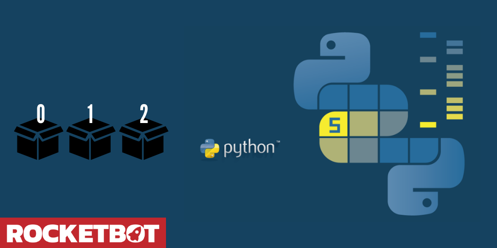

# ArrayWork
  
Modulo para trabajar con arrays y tablas  

*Read this in other languages: [English](Manual_ArrayWork.md), [Español](Manual_ArrayWork.es.md).*
  

## Como instalar este módulo
  
__Descarga__ e __instala__ el contenido en la carpeta 'modules' en la ruta de Rocketbot.  

## Descripción de los comandos

### Buscar elemento en una tabla
  
Obtiene la posicion de un elemento en una tabla. Debe ser un Array de arrays
|Parámetros|Descripción|ejemplo|
| --- | --- | --- |
|Valor a buscar|Valor a buscar en la tabla|Valor a buscar|
|Donde buscar|Donde buscar el valor|[[1,2,3],[4,5,6],[7,8,9]]|
|Nombre de la variable donde almacenar la posicion|Nombre de la variable donde se almacenaran las posiciones del elemento|Resultado|

### Eliminar dato en array
  
Elimina un dato en array por valor o posición
|Parámetros|Descripción|ejemplo|
| --- | --- | --- |
|Array|Array donde se eliminará el dato|{array}|
|Opción|Opción para eliminar dato|By Position|
|Valor o Posición a eliminar |Valor o posición a eliminar del array|test|
|Asignar resultado a variable |Variable donde se almacenará el resultado|test|

### Agregar dato en array
  
Agregar un dato en array, se puede indicar posición si es un sólo valor
|Parámetros|Descripción|ejemplo|
| --- | --- | --- |
|Array|Array donde se agregará el dato|{array}|
|Posición|Posición donde se agregará el dato|{position}|
|Valor a agregar |Valor a agregar en el array|test|
|Agregar como número|Agregar el valor como número|test|
|Asignar resultado a variable|Asigna el resultado de la ejecución a una variable|variable|

### Filtrar
  
Retorna un array filtrado
|Parámetros|Descripción|ejemplo|
| --- | --- | --- |
|Array|Array a filtrar|{array}|
|Condición|Condición a evaluar|Equal to|
|Dato a comparar|Dato a comparar|{data}|
|Asignar resultado a variable |Asignar resultado a variable|test|

### Contar elementos
  
Retorna el número de elementos en el array
|Parámetros|Descripción|ejemplo|
| --- | --- | --- |
|Array|Array a contar|{array}|
|Asignar resultado a variable |Variable donde se almacenará el resultado|test|
